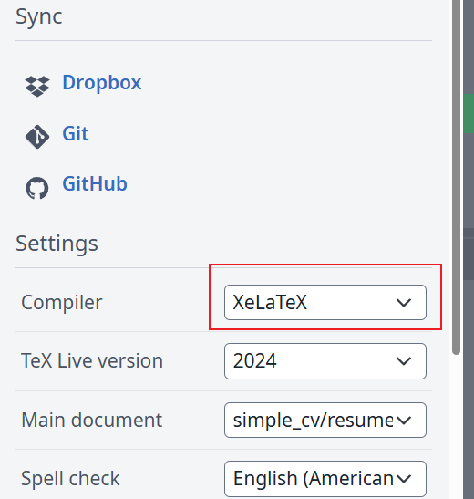

<!-- README (HTML版) -->

  <h1>📄 LaTeX 简历模板 · ResumeTemplate</h1>
  
一份结构清晰、中文友好的 LaTeX 简历模板，适配科研 / 竞赛 / 实习 / 校招等场景

  <!-- Badges -->
  

    
    
    
    
  

<section>
  <h2>✨ 特性亮点</h2>
  <ul>
    <li><b>模块化结构</b>：信息分区清晰，增删内容不破版。</li>
    <li><b>中文排版稳</b>：默认 <b>XeLaTeX</b>，中文字体与断行更自然。</li>
    <li><b>多场景适配</b>：科研、比赛、实习、校招一套模板搞定。</li>
    <li><b>即开即用</b>：Overleaf / 本地编译均可一键生成 PDF。</li>
  </ul>
</section>

<section>
  <h2>📦 项目结构</h2>
  <pre><code>.
├─ simple_cv/
│  ├─ resume-zh_CN.tex       # 主入口（编译此文件生成 PDF）
│  ├─ fonts/                 # 字体（可单独上传至 Overleaf）
│  └─ ...                    # 其它模板资源
├─ image/
│  ├─ step1.png
│  └─ step2.png
└─ README.md
</code></pre>
</section>

<section>
  <h2>⚡ 快速开始</h2>

  <h3>方式一：在 Overleaf 使用（推荐）</h3>
  <ol>
    <li>
      <b>准备压缩包</b>
      <ul>
        <li>Overleaf 单次上传限制为 <b>≤ 50MB</b>，建议先将 <code>simple_cv/fonts</code> 文件夹临时移出。</li>
        <li>将 <b><code>simple_cv</code> 整个文件夹</b> 打包为 <code>.zip</code>。</li>
      </ul>
    </li>
    <li>
      <b>上传并设置编译器</b>
      <ul>
        <li>打开 <a href="https://www.overleaf.com/">Overleaf</a>，创建新项目并上传 <code>.zip</code>。</li>
        <li>将 <b>Compiler</b> 调整为 <b>XeLaTeX</b>（如下图所示）。</li>
      </ul>
      

        
        
      

    </li>
    <li>
      <b>补充字体</b>
      <ul>
        <li>项目创建成功后，再把 <code>fonts</code> 文件夹单独上传回 <code>simple_cv/</code>。</li>
      </ul>
    </li>
    <li>
      <b>开始编辑</b>
      <ul>
        <li>打开 <code>simple_cv/resume-zh_CN.tex</code>，替换个人信息与经历，点击 <b>Recompile</b> 生成 PDF。</li>
      </ul>
    </li>
  </ol>
  
<i>小贴士：首次编译可能稍慢；若出现缺字形/乱码，优先检查 <code>fonts/</code> 是否完整、字体名称是否匹配。</i>

<section>
  <h2>🛠 自定义指南</h2>
  <ul>
    <li><b>修改个人信息</b>：编辑 <code>resume-zh_CN.tex</code> 顶部信息区（姓名 / 联系方式 / 链接等）。</li>
    <li><b>增删模块</b>：经验、教育、项目、论文等板块均为模块化，按需启用 / 注释。</li>
    <li><b>一页/两页控制</b>：微调行距、段距与条目数量，兼顾信息密度与可读性。</li>
  </ul>
</section>

<b>祝你顺利完成一份高质量的简历！</b>

